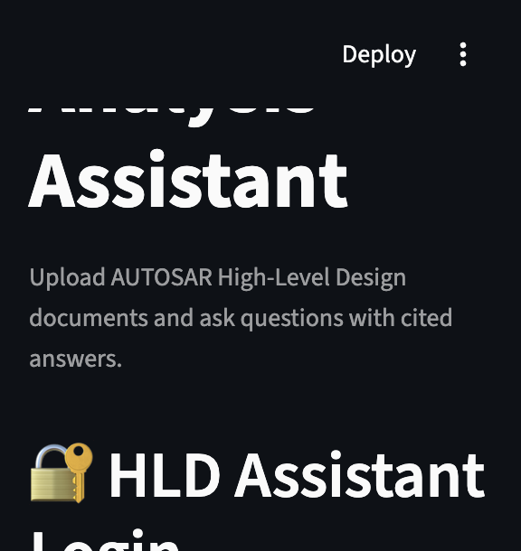
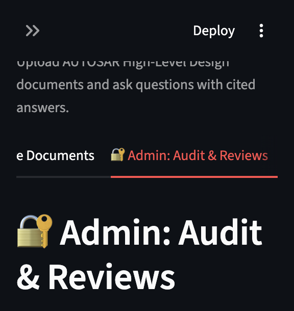
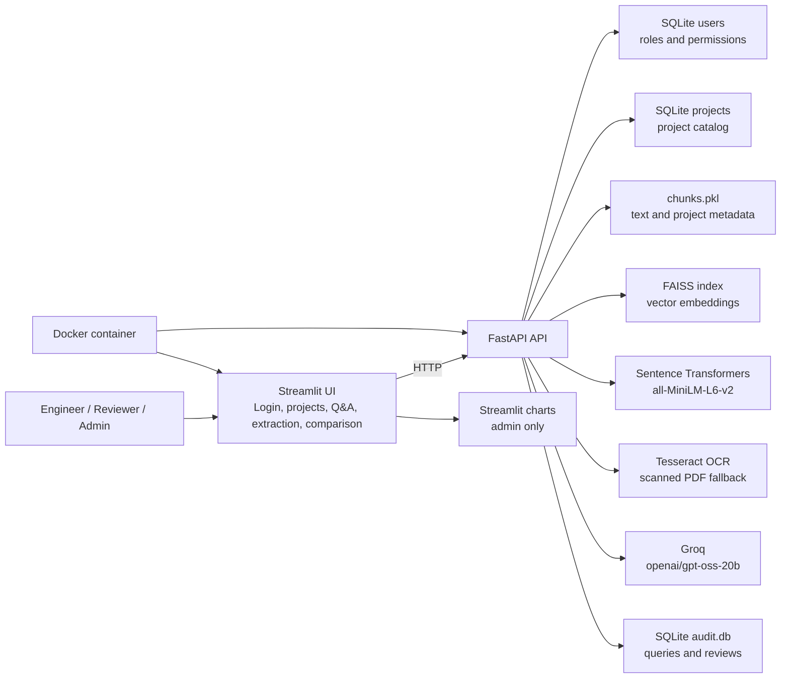

# AUTOSAR HLD Document Analysis Assistant

An AI-powered assistant for extracting, searching, comparing, and reviewing architectural knowledge from AUTOSAR High-Level Design documents. The project implements the main capabilities described in Case Study 1 of the *Automotive Engineering AI: Standard Project Case Study Document*.

## Screenshots

### Login and registration



The application starts behind a local login gate. Users can register as engineers, reviewers, or administrators.

### Admin audit and review dashboard



Administrators can inspect query and review tables, query volume by document, average confidence, and approved versus rejected review counts.

## Capabilities

- Upload PDF-based AUTOSAR HLD documents with PyMuPDF text extraction.
- Fall back to Tesseract OCR for scanned or image-heavy pages.
- Ask natural-language questions using FAISS retrieval and page-cited LLM answers.
- Extract components, interfaces, ports, and signals as structured JSON.
- Compare two documents for shared entities, naming inconsistencies, contradictions, and one-sided entities.
- Export project-scoped document chunks as JSON.
- Organize ingested documents into separate project collections.
- Authenticate local users with engineer, reviewer, and admin roles.
- Record queries and review decisions in SQLite audit tables.
- Display admin-only audit, confidence, and review analytics.
- Run the backend and Streamlit frontend locally or in one Docker container.

## Architecture



### Project isolation

Every ingested chunk carries a `project` value. Existing data is migrated to the `default` project. The active project selected in the sidebar is passed to upload, status, query, entity extraction, comparison, and export operations. A document stored in one project is not returned by another project's status or document operations.

## Technology stack

| Layer | Technology |
|---|---|
| Frontend | Streamlit |
| API | FastAPI |
| LLM | Groq, `openai/gpt-oss-20b` |
| Embeddings | Sentence Transformers, `all-MiniLM-L6-v2` |
| Vector search | FAISS |
| PDF extraction | PyMuPDF |
| OCR | Tesseract and pytesseract |
| Structured storage | SQLite |
| Analytics | pandas and Streamlit charts |
| Deployment | Docker |

## Feature-to-requirement mapping

| Requirement | Implementation |
|---|---|
| PDF ingestion | `/upload` with PyMuPDF extraction and project tagging |
| OCR for scanned pages | Tesseract fallback when extracted page text is very short |
| Natural-language search | `/query` with FAISS retrieval and cited answers |
| Entity inventory | `/extract_entities` with structured LLM JSON |
| Revision comparison | `/compare_documents` with shared entities and inconsistency reporting |
| Project collections | `/projects`, project-scoped chunks, and active sidebar project |
| Data export | `/export/{source}` with project filtering |
| Confidence indicators | Retrieval distance converted to a confidence score |
| Human review | `/review` with Approve/Reject controls |
| RBAC | Server-side engineer, reviewer, and admin checks |
| Auditability | SQLite query and review logs with usernames |
| Admin analytics | Query counts, confidence averages, and review decision charts |
| Deployment | `Dockerfile`, `.dockerignore`, and pinned `requirements.txt` |

## Roles

| Role | Permissions |
|---|---|
| `engineer` | Upload, query, extract entities, compare documents, export data |
| `reviewer` | All engineer permissions plus approve/reject AI answers |
| `admin` | All reviewer permissions plus audit logs, review history, and charts |

Authorization is enforced by the backend as well as reflected in the UI. Hiding a button is not the security boundary.

## API overview

| Method | Endpoint | Purpose |
|---|---|---|
| `POST` | `/register` | Register a local user |
| `POST` | `/login` | Authenticate a local user |
| `POST` | `/projects` | Create a project for a registered user |
| `GET` | `/projects` | List projects |
| `POST` | `/upload` | Ingest a PDF into a selected project |
| `GET` | `/status?project=...` | List project-scoped documents and chunk count |
| `POST` | `/query` | Ask a project-scoped question |
| `POST` | `/extract_entities` | Extract entities from a project-scoped document |
| `POST` | `/compare_documents` | Compare two documents within a project |
| `GET` | `/export/{source}?project=...` | Export project-scoped document data |
| `POST` | `/review` | Submit reviewer/admin feedback |
| `GET` | `/audit_log?role=admin` | Read query audit data |
| `GET` | `/reviews?role=admin` | Read review history |

## Running locally

```bash
python3 -m venv venv
source venv/bin/activate
pip install -r requirements.txt
```

Create a `.env` file with the Groq credential:

```bash
GROQ_API_KEY=your_key_here
```

Start the backend in one terminal:

```bash
uvicorn backend:app --reload
```

Start Streamlit in another:

```bash
streamlit run app.py
```

Open `http://localhost:8501`.

## Running with Docker

The image installs the Python dependencies and Tesseract OCR. The container exposes FastAPI on port 8000 and Streamlit on port 8501.

```bash
docker build -t autosar-hld-analysis-assistant .
docker run --env-file .env -p 8000:8000 -p 8501:8501 autosar-hld-analysis-assistant
```

Open `http://localhost:8501`.

The container is intentionally a pilot deployment with both processes in one container. A production deployment should separate the services and provide persistent volumes for `data/` and `uploads/`.

## Validation performed

- Python compilation for `backend.py` and `app.py`.
- Docker image build with the pinned dependency set.
- Fresh virtual-environment installation and Streamlit HTTP health check.
- Direct RBAC checks for engineer denial, reviewer approval, and admin access.
- Project isolation checks across separate test projects.
- Document comparison checks for related and unrelated documents.
- Friendly error checks with a simulated invalid Groq client.

## Pilot-scope limitations

- SQLite is used instead of PostgreSQL for local pilot simplicity.
- FAISS and pickle-backed metadata are local stores; production deployments should use durable, managed storage.
- Local authentication uses SHA-256 as a pilot simplification. This is not production-grade password storage; production should use a dedicated identity provider or a password hashing scheme such as Argon2 or bcrypt.
- There is no OAuth or SSO integration.
- Backend and frontend run together in the provided single-container Docker command.

## License and usage

This is an engineering pilot. AI-generated answers, extracted entities, and comparison findings must be reviewed by qualified engineers before use in compliance, design approval, or release decisions.
# AUTOSAR HLD Document Analysis Assistant

An AI-powered assistant that helps automotive engineers extract, search, and validate architectural knowledge from AUTOSAR High-Level Design (HLD) documents — built as an implementation of **Case Study 1** from the *Automotive Engineering AI: Standard Project Case Study Document*.

## What it does

Upload an AUTOSAR HLD PDF and:
- Ask natural-language questions and get **cited, grounded answers** (RAG pipeline)
- See a **confidence score** for every answer
- Filter questions to a **specific document** when multiple are loaded
- Automatically extract a structured inventory of **components, interfaces, ports, and signals**
- **Compare two documents** and get flagged inconsistencies (e.g., renamed interfaces, contradicting descriptions)
- **Export** any document's data as structured JSON
- Review AI answers with an **Approve/Reject** workflow (role-gated)
- Full **Role-Based Access Control** (engineer / reviewer / admin)
- Automatic **OCR fallback** for scanned/image-based PDF pages
- Every query and review decision is recorded in a **SQLite audit log**

## Architecture

| Layer | Technology | Doc reference |
|---|---|---|
| Frontend | Streamlit | "Streamlit for rapid engineering interfaces" |
| Backend API | FastAPI | "FastAPI as the preferred service layer" |
| LLM | Groq (Llama-family model, `openai/gpt-oss-20b`) | "Any suitable enterprise-approved or open-source LLM" |
| Embeddings | Sentence Transformers (`all-MiniLM-L6-v2`) | "BGE, E5, Sentence Transformers, or equivalent" |
| Vector store | FAISS | "FAISS or ChromaDB... for pilots" |
| OCR | Tesseract | "OCR for scanned pages" |
| Structured storage | SQLite | "SQLite for pilot" |
| Deployment | Docker | "Docker; optional Kubernetes" |

## Feature-to-requirement mapping

| Case Study 1 Requirement | Implementation |
|---|---|
| PDF ingestion | PyMuPDF text extraction |
| OCR for scanned pages | Tesseract fallback when page text < 20 chars |
| Component/interface/signal extraction | `/extract_entities` endpoint, LLM-based structured extraction |
| Natural language search with citations | `/query` endpoint, RAG with page-level citations |
| Document comparison / inconsistency reporting | `/compare_documents` endpoint |
| Export of structured findings | `/export/{source}` endpoint, JSON download |
| Confidence indicators | FAISS distance → confidence score, shown in UI |
| Audit logs | SQLite `query_log` table, timestamped |
| Human review and approval | `/review` endpoint, Approve/Reject buttons (reviewer/admin only) |
| Role-based access control | SQLite `users` table, SHA-256 auth, enforced per-endpoint |
| Deployment | `Dockerfile`, verified running end-to-end |

## Roles

| Role | Permissions |
|---|---|
| `engineer` | Upload, ask questions, extract entities, compare documents, export data |
| `reviewer` | All engineer permissions + Approve/Reject AI answers |
| `admin` | All reviewer permissions + view full audit log and review history |

Role checks are enforced **server-side** (not just hidden in the UI) — verified via direct API calls bypassing the frontend.

## Running locally

```bash
# 1. Set up environment
python3 -m venv venv
source venv/bin/activate
pip install -r requirements.txt

# 2. Add your Groq API key to .env
echo "GROQ_API_KEY=your_key_here" > .env

# 3. Run backend
uvicorn backend:app --reload

# 4. Run frontend (separate terminal)
streamlit run app.py
```

## Running with Docker

```bash
docker build -t hld-assistant .
docker run -p 8000:8000 -p 8501:8501 --env-file .env hld-assistant
```

Visit `http://localhost:8501`.

## Known simplifications (pilot-scope decisions)

- **PostgreSQL**: not used — the reference doc explicitly allows SQLite for pilot scale.
- **Neo4j graph store**: not implemented — the doc lists this as a Phase 2+ "scale" feature, not a pilot requirement.
- **Password hashing**: uses SHA-256 for local demonstration purposes; a production system would use a stronger scheme (e.g., bcrypt/argon2) and a managed identity provider.
- **Single-container deployment**: backend and frontend run in one container for simplicity; a production setup would split these into separate services via `docker-compose`.

## Tech stack summary

Python · FastAPI · Streamlit · FAISS · Sentence Transformers · Tesseract OCR · Groq (Llama) · SQLite · Docker